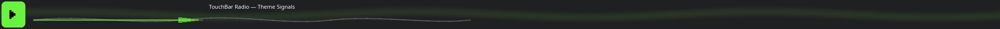
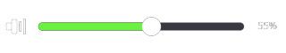
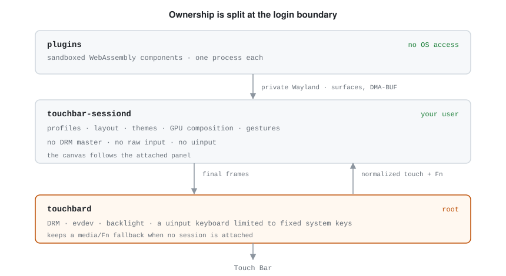
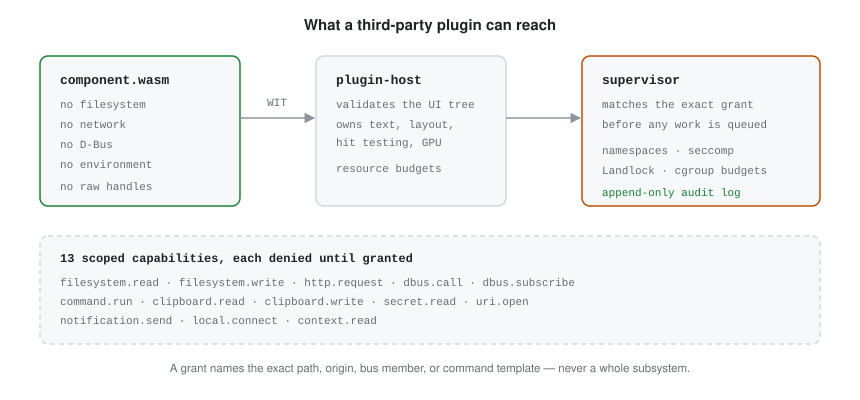

# TouchBar

**A Touch Bar platform for Linux.** A GPU-composited runtime for the MacBook Pro
Touch Bar, and a sandboxed plugin system for putting your own things on it.

[](https://github.com/cameroncooper/touchbar/actions/workflows/ci.yml)
[](#license)



Plugins are WebAssembly components. They reach the desktop only through
capabilities you grant one at a time, scoped to an exact path, origin, D-Bus
member, or command template — never a whole subsystem. Every call is recorded in
an append-only audit log.

If you had MTMR, Pock, or BetterTouchTool on macOS and lost it: this is that,
sandboxed. If you run `tiny-dfr` today: this is a superset that hands the strip
straight back if you don't like it.

## Build a Touch Bar app — no Mac required

`touchbarctl plugin dev` runs the real compositor and puts the real 2008×60
scene in a desktop window, so you can build and test plugins on any Linux
machine.

```bash
git clone https://github.com/cameroncooper/touchbar && cd touchbar
cargo build --release

./target/release/touchbarctl plugin new my-plugin
cd my-plugin
touchbarctl plugin build     # compiles to wasm32-wasip2
touchbarctl plugin dev       # opens the simulator
```

`plugin new` scaffolds a working two-item plugin with tests and release
workflows. `plugin test` renders every item at each responsive width, and
`plugin replay` drives deterministic interaction scenarios with typed fixtures
for every capability — no hardware, no network, no live services.

Plugins can draw with the GPU without leaving the sandbox — vector commands
through Canvas2D, or a small validated WGSL body for animated effects — and
neither needs a single capability. See
[the drawing example](examples/drawing-component-plugin). Native plugins can
take a raw GLES context instead, as an explicit escape hatch.

See [Build a plugin](docs/plugin-author-context.md),
[the simulator](docs/design/onscreen-simulator.md), and
[the other examples](examples).

## Have a Touch Bar MacBook?

### Requirements

| | |
|---|---|
| **Verified** | MacBook Pro 13″ M1 (`MacBookPro17,1`) on Asahi Linux |
| **Expected** | MacBook Pro 13″ M2 (`Mac14,7`) — unverified, [please report](https://github.com/cameroncooper/touchbar/issues) |
| **In progress** | Intel T2 (`appletbdrm`) — implemented, not yet hardware-verified |
| **Also needs** | systemd · polkit · Wayland · `tiny-dfr` installed as the rollback target |

### Install

Nothing happens at install time. The services start only once a root-owned
marker exists, so you choose when to hand the strip over.

```bash
cd packaging/aur/touchbar && makepkg -si   # or build from source
touchbar-activate                          # takes over; masks tiny-dfr
```

Check it with `touchbarctl hardware status` and `touchbarctl session status`.

### Rollback

```bash
touchbar-rollback
```

Stops both services, unmasks and starts `tiny-dfr`, and leaves the package in
place. It fails closed rather than ever letting two DRM owners start together,
and it does not need the TouchBar binaries to still be intact.

If a plugin ever wedges the strip, hold the physical **Fn** key for eight
seconds: the hardware service drops the user session and latches its own trusted
media/Fn row. Hold it again to resume.

## What ships today

A fresh install gives you **the system row** — media keys, and F1–F12 while Fn
is held — with the same dim and sleep behaviour as `tiny-dfr`. Nothing else is
enabled, because nothing else is finished enough to enable for you.

Five worked examples live in [`plugins/`](plugins). They are 150–290 line
vertical slices that prove the platform, not products, so read them as tutorials
rather than installing them:

| Example | Shows |
|---|---|
| [System Controls](plugins/controls) | sliders, glanceable progress, toggles, command templates |
| [Media](plugins/media) | MPRIS over D-Bus, artwork, a captured timeline |
| [Hyprland Navigator](plugins/hyprland) | focus context, workspace scrubbing, typed `hyprctl` |
| [Capture Studio](plugins/capture) | multi-action palettes, destructive state |
| [Command Deck](plugins/command-deck) | a user-owned local action service |



The [pack catalog](catalog) is open for submissions and currently empty.
`touchbarctl plugin search` will stay quiet until packs are published to it.

## How it works

<picture>
  <source media="(prefers-color-scheme: dark)" srcset="docs/images/diagrams/privilege-split-dark.svg">
  
</picture>

Two services, split at the login boundary. `touchbard` runs as root and owns the
hardware; it keeps a trusted fallback row when no session is attached, so a
crash in your session leaves a working function row rather than a dark strip.
`touchbar-sessiond` runs as you, owns everything about the experience, and never
receives DRM master, raw input, or uinput.

<picture>
  <source media="(prefers-color-scheme: dark)" srcset="docs/images/diagrams/sandbox-dark.svg">
  
</picture>

More in [the design notes](docs/design): the
[service architecture](docs/design/service-architecture.md), the
[capability and consent contract](docs/design/capability-consent.md), and the
[adversarial review](docs/security/sandbox-abuse-review.md).

## Status

Working: the two-service split, GPU composition with zero-copy DMA-BUF, the
component sandbox and its thirteen capabilities, per-session and persistent
consent, profiles and theming, the package format and content-addressed store,
deterministic replay, and the simulator.

Known limits:

- Physical presentation runs at **~29.9 Hz**, a limit of the experimental ADP
  kernel driver. Plugin rendering and compositing run at 60 FPS.
- Of the five presentation policies in the protocol, only anchored overlays are
  accepted; the rest are typed but deliberately rejected.
- Components draw from a fixed catalogue of seven icons.
- Verified on one machine. See the table above.

The development log, with the acceptance measurements taken at each step, is in
[docs/history.md](docs/history.md).

## Contributing

See [CONTRIBUTING.md](CONTRIBUTING.md). Note that
`./scripts/test-sandbox-security.sh` is the release gate and needs a real login
session — CI cannot assert OS confinement, so a green badge is not the evidence
that the sandbox holds.

## License

MIT ([LICENSE-MIT](LICENSE-MIT)) or Apache-2.0 ([LICENSE-APACHE](LICENSE-APACHE)),
at your option.

## Credits

[`tiny-dfr`](https://github.com/WhatAmISupposedToPutHere/tiny-dfr) for showing
the Touch Bar could work well on Linux, and for being a dependable place to
land. [Asahi Linux](https://asahilinux.org) for the kernel this runs on.
