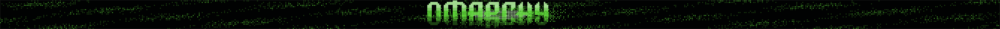

# Omarchy

The Touch Bar as part of an Omarchy desktop: the pixel field from the Omarchy
homepage re-composed for a 2008x60 ribbon, plus a palette strip that proves it
is wearing the current theme.



**This package requests no capabilities.** It is three validated effects, one
retained canvas, and host-timed motion. It cannot read the filesystem, the
network, or D-Bus, and it never learns the theme's name or a single hex value —
only the semantic roles the host resolves for it at paint time.

## Items

| Item | What it is |
|---|---|
| `screensaver` | A sparse pixel field with the homepage's five-band wordmark, a light sweeping the long axis, expanding centre ripples, and a wake that hands the strip back |
| `palette` | Every resolved role side by side, so a theme change is either visibly right or visibly wrong |

## Try it

```bash
touchbarctl plugin build --package plugins/omarchy
touchbarctl plugin dev   --package plugins/omarchy --item screensaver
```

Tap the strip in the simulator to watch the wake. Tap again to go back.

For a disposable full-width preview on the real Touch Bar:

```bash
touchbarctl plugin run \
  --package plugins/omarchy --item screensaver --width 2008
```

To test the real focus-driven handoff, bind the disposable preview profile to
Omarchy's screensaver class, then activate and focus the screensaver while the
runner is active:

```bash
touchbarctl plugin run \
  --package plugins/omarchy --item screensaver --width 2008 \
  --when-application org.omarchy.screensaver

omarchy-launch-screensaver force
```

The command builds and validates the local package, installs it only into an
isolated temporary store, asks the installed user session to yield its hardware
connection, and launches the workspace session compositor. The privileged
hardware service remains running throughout. Ctrl-C restores the installed user
session automatically. Add `--sandboxed` when specifically testing production
permissions and broker behavior.

`plugin replay --scenario tests/replay.json --screenshots DIR` renders the whole
sequence — rest, a light and ripple crossing the field, a theme change
mid-animation, reduced motion, and both wake frames — without hardware.

## Designed for this strip, not a phone

The Touch Bar is 2008x60: a 33:1 ribbon that is mostly negative space. At full
height, the site's 81x19 wordmark becomes a crisp 3px grid, 243px wide. Its
roaming light becomes a minute-long end-to-end sweep, while a circular pulse
reads on the shallow panel as two fronts moving away from centre. The panel is
also OLED, so the mark breathes and drifts slowly around centre instead of
holding one intensity and position forever.

Everything is paced for ~30 Hz. Physical presentation runs at 29.9 Hz and the
animation cadence drops to 30 Hz on battery. Under `motion = "reduced"` the same
composition holds still: the host freezes the effect's clock, and the component
drops its motion nodes rather than leaving them frozen mid-drift.

## One shared pixel grid

The field uses three small validated effects—quiet pixels, the roaming light,
and the expanding ripple—all quantized onto one logical grid aligned to the
wordmark. Splitting those passes keeps each program inside the host's strict
straight-line shader budget. Cell energy is snapped to four theme-derived tones
rather than rendered as a smooth gradient.

The exact 81x19 wordmark bitmap is drawn as contiguous canvas runs. Its upper
rows combine `accent` and `foreground` into crest and hover bands; its lower
rows fade `accent` over the opaque background into mid and dim bands. This
retains the homepage silhouette and stepped vertical color treatment without a
texture, browser, network access, or literal theme colors.

## Wearing the Omarchy theme

`touchbar-sessiond` reads `~/.config/touchbar/theme.toml` as flat `key = "value"`
lines, and takes `mode`, `background`, `foreground`, `accent`, `selection`,
`muted`, and `red`. An Omarchy theme's `colors.toml` ships exactly those keys, so
the shortest bridge that works is a symlink:

```bash
ln -sfn ~/.local/state/omarchy/current/theme/colors.toml ~/.config/touchbar/theme.toml
```

`omarchy theme set` restages that directory, the session daemon notices within
its 250 ms poll, and the strip recolors with the desktop.

`bridge/touchbar-theme.hook` is the version to ship, and generates the file
rather than aliasing it — motion policy and animation cadence are the strip's
business, not the theme's:

```bash
install -Dm644 plugins/omarchy/bridge/touchbar-theme.hook \
  ~/.config/omarchy/hooks/theme-set.d/touchbar-theme.hook
```

This is also what gives the field its identity. `accent` supplies the lit tone,
`background` pulls it down into dim and mid pixels, and `foreground` lifts it
into hover and crest pixels, without the package knowing the theme's name.

## What is still a prototype

- **The wake is a press.** In a session it should be a profile switch: Omarchy's
  screensaver is a window (class `org.omarchy.screensaver`), the session daemon
  already tails Hyprland's event socket for context, and profile rules already
  switch on a context fact. That is the cheap path — no new presentation policy,
  and `full-bar` is still deliberately rejected. The press is how the simulator
  gets to see the animation.
- **Backlight.** `touchbard` drops to its idle level on seat inactivity, so
  today this plays dim. Dim is arguably correct and power-honest, but it should
  be a decision rather than a discovery.
- **The wordmark.** Its bitmap follows the public Omarchy homepage wordmark.
  Shipping that branding in a third-party package remains a trademark question;
  reading the user's own `~/.config/omarchy/branding/` through a path-scoped
  `filesystem.read` grant would make the desktop and strip share one source.
